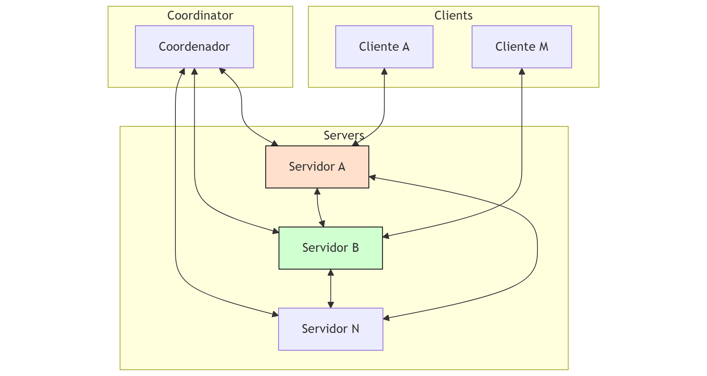

# Distributed Social Network – Project Overview

## Summary

This project implements a distributed social network with **Coordinator**, **Servers**, and **Clients**.  
- The **Coordinator** manages server registration and distributes the list of active servers.  
- **Servers** manage users, posts, private messages, and synchronize data for consistency.  
- **Clients** (in JavaScript) allow users to interact with the network (posting, messaging, following, etc.).

---

## System Architecture

### Component Roles

- **Coordinator**:  
  Registers new servers and provides the active server list.

- **Server**:  
  - Handles users, posts, and private messages.  
  - Synchronizes data with other servers.  
  - Maintains Lamport clocks for event ordering.

- **Client (JavaScript)**:  
  - Interacts with servers for user actions.  
  - Sends/receives posts, messages, and follows users.

### Communication Flow



- **Coordinator <-> Servers**: Registration and server list updates  
- **Server <-> Server**: Synchronize data (posts, users, messages)  
- **Client <-> Server**: User interactions (posting, messaging, following, etc.)

---

## Event Ordering: Lamport Clocks

All components use **Lamport clocks** to order events and ensure consistency across distributed nodes.

---

## How to Run

### 1. Start Coordinator
```bash
./server/coordinator
```

### 2. Start a Server
```bash
python -m server.server <name> <base_port>
```

### 3. Start a Client (JavaScript)
```bash
node client/client.js <base_port>
```

---

## How to Test

1. Start all components as described above  
2. In the client, register a user and log in  
3. Test features using commands:
   - `post`: Send a post
   - `follow`: Follow a user
   - `message`: Send a private message
   - `history`: View message history  
4. Check logs:
   - Server: `server_<name>.log`  
   - Client: `client_<username>.log`

---

## Message Protocols

### Client -> Server

#### Send a Post
```json
{ "type": "post", "id": "<user_id>", "name": "<username>", "text": "<post_content>", "lamport": <lamport_clock> }
```

#### Get All Posts
```json
{ "type": "get_posts" }
```

#### Get User ID
```json
{ "type": "get_user_id", "username": "<target_username>" }
```

#### Send Private Message
```json
{ "type": "message", "to": "<recipient_id>", "from_name": "<sender_username>", "text": "<message_content>", "lamport": <lamport_clock> }
```

#### Get Private Message History
```json
{ "type": "get_messages", "user1": "<username_1>", "user2": "<username_2>" }
```

#### Register User
```json
{ "type": "user_info", "user_id": "<generated_uuid>", "username": "<user_chosen_name>" }
```

---

### Server -> Client

#### Post Acknowledgement
```json
{ "status": "ok", "lamport": <server_clock_time> }
```

#### User ID Response
```json
{ "found": <boolean>, "id": "<user_id>" }
```

#### List of Posts
```json
[ "<formatted_post_entry_1>", "<formatted_post_entry_2>", ... ]
```

#### Message History
```json
[
  [<lamport_time_1>, "<message_text_1>"],
  [<lamport_time_2>, "<message_text_2>"]
]
```

#### Error Message
```json
{ "type": "error", "message": "<error_description>" }
```

#### Incoming Private Message
```json
{ "type": "message", "from_name": "<sender_username>", "content": "<message_text>", "lamport": <sender_clock> }
```

#### New Post Notification
```json
"<user_id>::<username>::<formatted_post_entry>"
```

---

### Server <-> Coordinator

#### Register Server
```json
{ "type": "register_server", "server_name": "<name>", "server_ip": "<ip_address>", "server_port": <port_number> }
```

#### Request Server List
```json
{ "type": "get_servers" }
```

#### Server List Response
```json
{
  "servers": [
    { "name": "<name_1>", "ip": "<ip_1>", "port": <port_1> },
    ...
  ]
}
```

---

### Server <-> Server

#### Sync Request (new server joining)
```json
{ "type": "sync_request", "from": "<new_server_name>" }
```

#### Sync Response
```json
{
  "type": "sync_response",
  "posts": [<list_of_posts>],
  "users": [<user_data>],
  "private_messages": {
    "<user1>::<user2>": [[<lamport>, "<msg>"], ...]
  },
  "lamport": <current_clock_value>
}
```

---

## Debugging and Logs

Logs are created for troubleshooting and event tracing:
- Server logs: `server_<name>.log`
- Client logs: `client_<username>.log`

---
